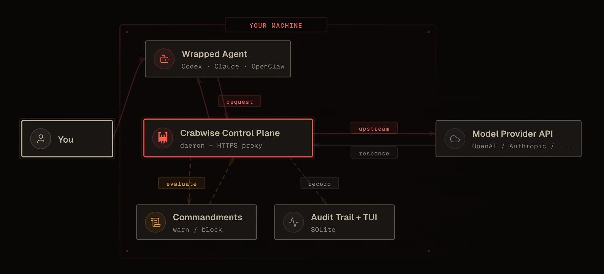

<div align="center">

<a href="https://crabwise.ai">
  <picture>
    <source media="(prefers-color-scheme: dark)" srcset="public/readme-logo-dark.svg" width="520">
    <source media="(prefers-color-scheme: light)" srcset="public/readme-logo-light.svg" width="520">
    
  </picture>
</a>

### Crabwise / The local control plane for your AI agents

Observe, govern, and audit what Claude Code, Codex CLI, and OpenClaw do on your machine.

<p>
  <a href="LICENSE"></a>
  <a href="https://github.com/crabwise-ai/crabwise/releases"></a>
  
  
  <a href="https://x.com/crabwise_ai"></a>
</p>

<p>
  <a href="#quick-start"><strong>Quick Start</strong></a>
  ·
  <a href="https://github.com/crabwise-ai/crabwise/releases"><strong>Releases</strong></a>
  ·
  <strong>Docs (coming soon)</strong>
</p>

</div>

Crabwise is a local-first daemon plus CLI for monitoring, audit, and policy enforcement around AI agents. It watches agent activity, can proxy provider traffic for enforcement, stores a hash-chained audit trail in SQLite, and keeps the control plane on your machine instead of sending it to a hosted service.

Built for solo developers, builders, and OpenClaw users. Current support is focused on Claude Code, Codex CLI, and OpenClaw-aware workflows.

## Why Crabwise

- See what your agents are doing in real time
- Enforce local policies before risky actions or provider calls go through
- Keep audit history and operational visibility on your own machine
- Route local agents through a single control point with `crabwise wrap`
- Inspect status, activity, policies, and history from fast terminal UIs

## Quick Start

Install Crabwise:

```bash
curl -sSfL https://raw.githubusercontent.com/crabwise-ai/crabwise/main/install.sh | bash
```

Initialize config and generate the local CA:

```bash
crabwise init
crabwise cert trust --copy
```

Start the daemon:

```bash
crabwise start
```

Launch an agent through Crabwise:

```bash
crabwise wrap -- codex
# or
crabwise wrap -- claude
# or
crabwise wrap -- openclaw gateway
```

In another terminal:

```bash
crabwise status
crabwise agents
crabwise watch
crabwise audit
```

Stop the daemon when you are done:

```bash
crabwise stop
```

## How Requests Flow



Crabwise sits between the wrapped agent and the model provider. Requests and responses flow through the local proxy, policies are evaluated locally, and audit history stays on your machine.

## Main Features

### Local-first audit trail

Crabwise records normalized agent and proxy events in a local SQLite database with hash chaining, so you can inspect activity and verify integrity without depending on a remote service.

### Policy enforcement

Crabwise can evaluate requests before they reach the model provider and evaluate supported tool-use payloads before they reach the agent. Policies are defined in YAML and support both `warn` and `block` outcomes.

### Fast terminal workflows

The CLI is built for day-to-day use:

- `crabwise status` for daemon and proxy health
- `crabwise agents` for discovered agent sessions
- `crabwise watch` for live activity
- `crabwise audit` for historical events
- `crabwise commandments list` for active policies

### Works with builders

Use `crabwise wrap -- <command>` to route a local agent, script, or tool runner through Crabwise without permanently changing your shell environment.

### OpenClaw support

When enabled, Crabwise connects to a local OpenClaw Gateway and correlates activity with OpenClaw sessions. Current enforcement is focused on provider-side governance through the Crabwise proxy.

## Notes

- The proxy uses a local CA certificate to inspect HTTPS traffic.
- Crabwise is usable now, but still a pragmatic v1 focused on Claude Code, Codex CLI, wrapped local agents, and OpenClaw-aware workflows.
- A dedicated documentation site will cover the full command reference, flags, configuration, and deeper operational details.

## Development

```bash
make build
make test
```

## License

Licensed under AGPL-3.0. See [LICENSE](LICENSE).
