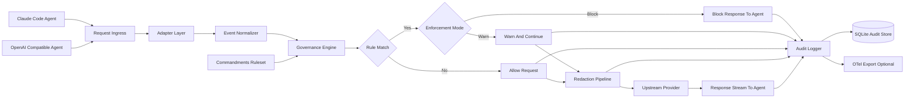

# Crabwise Prototype — Control Plane Governance Diagram

```mermaid
flowchart LR
  A1[Claude Code Agent]
  A2[OpenAI Compatible Agent]

  RI[Request Ingress]
  ADP[Adapter Layer]
  NRM[Event Normalizer]
  GOV[Governance Engine]
  RULES[Commandments Ruleset]

  M1{Rule Match}
  M2{Enforcement Mode}

  BLK[Block Response To Agent]
  WRN[Warn And Continue]
  ALW[Allow Request]

  RED[Redaction Pipeline]
  UP[Upstream Provider]
  RSP[Response Stream To Agent]

  AUD[Audit Logger]
  DB[(SQLite Audit Store)]
  OTL[OTel Export Optional]

  A1 --> RI
  A2 --> RI
  RI --> ADP
  ADP --> NRM
  NRM --> GOV
  RULES --> GOV

  GOV --> M1
  M1 -->|No| ALW
  M1 -->|Yes| M2

  M2 -->|Block| BLK
  M2 -->|Warn| WRN

  WRN --> RED
  ALW --> RED
  RED --> UP
  UP --> RSP

  BLK --> AUD
  WRN --> AUD
  ALW --> AUD
  RED --> AUD
  RSP --> AUD

  AUD --> DB
  AUD --> OTL
```
