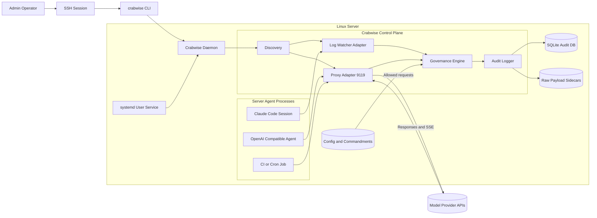

# Crabwise Prototype — Server Installation Diagram

```mermaid
flowchart LR
  Admin[Admin Operator]
  SSH[SSH Session]
  CLI[crabwise CLI]

  subgraph S[Linux Server]
    SD[systemd User Service]
    D[Crabwise Daemon]

    subgraph A[Server Agent Processes]
      CC[Claude Code Session]
      OA[OpenAI Compatible Agent]
      Job[CI or Cron Job]
    end

    subgraph CP[Crabwise Control Plane]
      DISC[Discovery]
      LW[Log Watcher Adapter]
      PX[Proxy Adapter 9119]
      GOV[Governance Engine]
      AUD[Audit Logger]
    end

    DB[(SQLite Audit DB)]
    RAW[(Raw Payload Sidecars)]
    CFG[(Config and Commandments)]
  end

  UP[(Model Provider APIs)]

  Admin --> SSH --> CLI
  CLI --> D
  SD --> D

  D --> DISC
  DISC --> LW
  DISC --> PX

  CC --> LW
  OA --> PX
  Job --> PX

  LW --> GOV
  PX --> GOV
  CFG --> GOV

  GOV --> AUD
  AUD --> DB
  AUD --> RAW

  PX -->|Allowed requests| UP
  UP -->|Responses and SSE| PX
```
