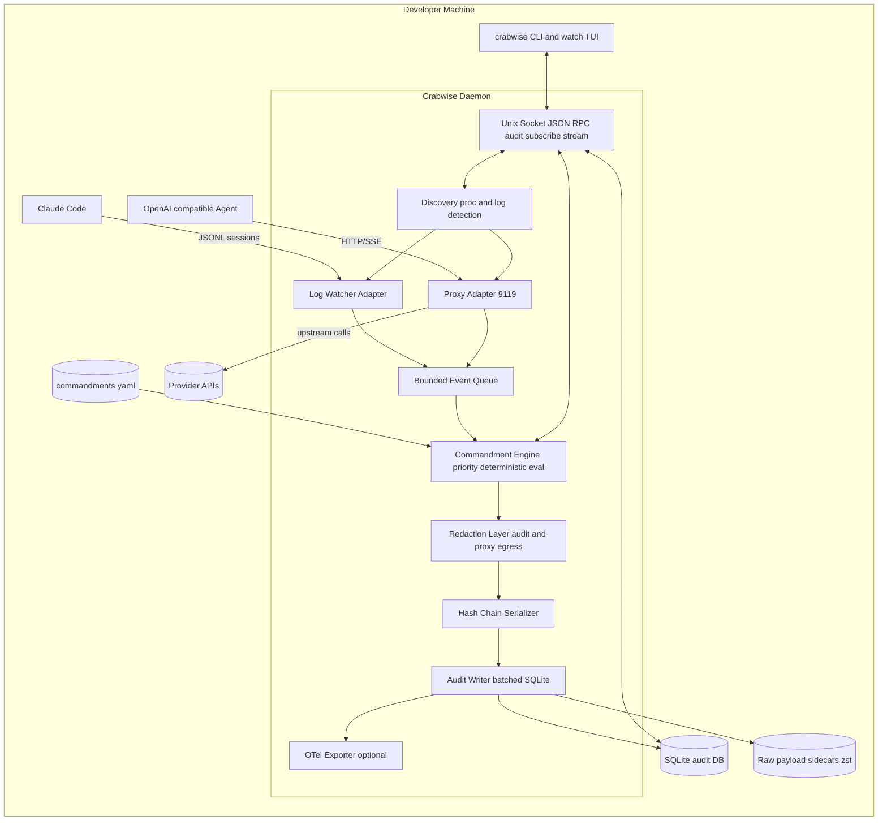

# Crabwise Prototype — Technical Architecture Diagram

```mermaid
flowchart LR
  subgraph U["Developer Machine"]
    A1[Claude Code]
    A2[OpenAI compatible Agent]
    CLI[crabwise CLI and watch TUI]

    subgraph D["Crabwise Daemon"]
      DISC[Discovery proc and log detection]
      LW[Log Watcher Adapter]
      PX[Proxy Adapter 9119]
      Q[Bounded Event Queue]
      CE[Commandment Engine priority deterministic eval]
      RED[Redaction Layer audit and proxy egress]
      HC[Hash Chain Serializer]
      AW[Audit Writer batched SQLite]
      IPC[Unix Socket JSON RPC audit subscribe stream]
      OTL[OTel Exporter optional]
    end

    DB[(SQLite audit DB)]
    RAW[(Raw payload sidecars zst)]
    CMD[(commandments yaml)]
    P[(Provider APIs)]
  end

  A1 -->|JSONL sessions| LW
  A2 -->|HTTP/SSE| PX
  PX -->|upstream calls| P

  DISC --> LW
  DISC --> PX
  CMD --> CE

  LW --> Q
  PX --> Q
  Q --> CE
  CE --> RED
  RED --> HC
  HC --> AW
  AW --> DB
  AW --> RAW
  AW --> OTL

  CLI <--> IPC
  IPC <--> DB
  IPC <--> CE
  IPC <--> DISC
```
