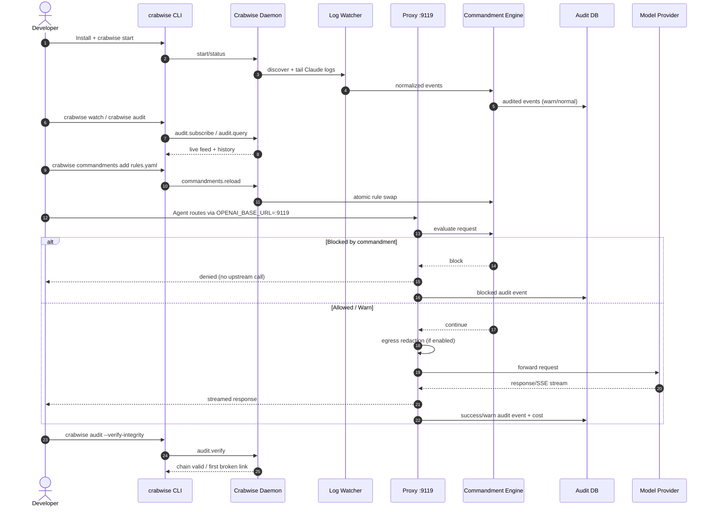

# Crabwise Prototype — User Flow Diagram

```mermaid
sequenceDiagram
  autonumber
  actor Dev as Developer
  participant CLI as crabwise CLI
  participant Daemon as Crabwise Daemon
  participant LW as Log Watcher
  participant Proxy as Proxy :9119
  participant Rules as Commandment Engine
  participant Store as Audit DB
  participant Up as Model Provider

  Dev->>CLI: Install + crabwise start
  CLI->>Daemon: start/status
  Daemon->>LW: discover + tail Claude logs
  LW->>Rules: normalized events
  Rules->>Store: audited events (warn/normal)

  Dev->>CLI: crabwise watch / crabwise audit
  CLI->>Daemon: audit.subscribe / audit.query
  Daemon-->>CLI: live feed + history

  Dev->>CLI: crabwise commandments add rules.yaml
  CLI->>Daemon: commandments.reload
  Daemon->>Rules: atomic rule swap

  Dev->>Proxy: Agent routes via OPENAI_BASE_URL=:9119
  Proxy->>Rules: evaluate request
  alt Blocked by commandment
    Rules-->>Proxy: block
    Proxy-->>Dev: denied (no upstream call)
    Proxy->>Store: blocked audit event
  else Allowed / Warn
    Rules-->>Proxy: continue
    Proxy->>Proxy: egress redaction (if enabled)
    Proxy->>Up: forward request
    Up-->>Proxy: response/SSE stream
    Proxy-->>Dev: streamed response
    Proxy->>Store: success/warn audit event + cost
  end

  Dev->>CLI: crabwise audit --verify-integrity
  CLI->>Daemon: audit.verify
  Daemon-->>CLI: chain valid / first broken link
```
