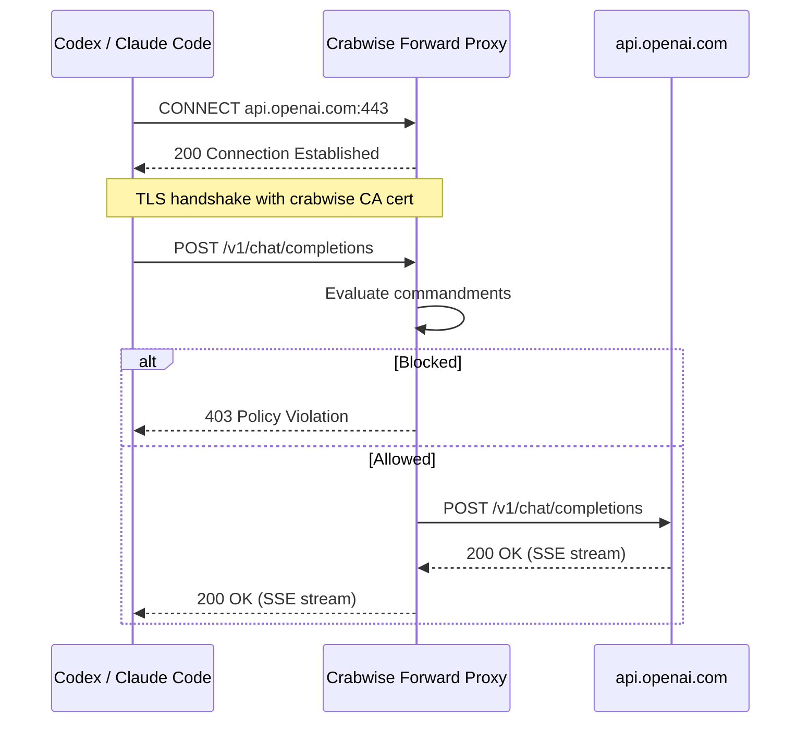

# Reliable Proxy Enforcement for Crabwise

## Problem

The [investigation](docs/proxy-blocking-investigation.md) confirms zero proxy traffic from Codex despite a healthy proxy listener. The proxy is a **reverse proxy** -- clients must change their API base URL to `http://127.0.0.1:9119`. Codex never did this, so all traffic went directly to OpenAI.

The reverse proxy approach is inherently fragile: each client has its own env var, users forget to set them, and nothing prevents bypassing. We are dropping it entirely in favor of a forward proxy.

## Solution: Forward Proxy with MITM TLS

Convert to a standard HTTP forward proxy (HTTP CONNECT + selective MITM TLS). This is how mitmproxy, Charles Proxy, and corporate HTTPS proxies work.

**Why this works:**

- **One env var covers all providers**: `HTTPS_PROXY=http://127.0.0.1:9119`
- **Common HTTP stacks auto-detect it**: Go `net/http`, Node.js, Python `requests`, `curl` (validated per-client in tests)
- **No per-client base URL knowledge needed**: client connects to the real domain; proxy sees it in the CONNECT header
- **Existing proxy internals are fully reused**: the CONNECT handler is a new outer shell that feeds decrypted requests into the existing `handleProxy` pipeline

## Locked Decisions (M2)

### 1) Unknown CONNECT targets are deny-by-default

- Intercept set is derived from configured provider upstream domains.
- If a client sends `CONNECT` for a host outside that set:
  - return `403` with stable error type `domain_not_allowed`
  - emit an audit event with `decision=deny`, `target_host`, and `reason=not_in_intercept_set`
- Optional escape hatch: `default_connect_policy: tunnel` with explicit `tunnel_allow_domains`; never unrestricted open tunneling.
- Bind remains loopback by default (`127.0.0.1`) to avoid open-proxy exposure.

### 2) Initial ALPN scope is client-edge HTTP/1.1 only

- MITM TLS advertises `NextProtos: ["http/1.1"]` on the client-facing side.
- Decrypted requests run through existing HTTP/1.1 `handleProxy` pipeline.
- Upstream transport protocol remains independent (can use h2 where Go transport negotiates it).
- Full client-edge HTTP/2 termination/multiplexing is explicitly deferred to a later phase.
- Add observability counters for handshake/protocol failures (`tls_handshake_failed`, `client_protocol_unsupported`).

### 3) CA lifecycle is explicit and fail-safe

- CA key (`ca.key`) must be private (`0600`) and owned by the running user; cert/key permissions are validated at startup when `strict_ca_permissions=true`.
- `crabwise init` is idempotent: if valid CA files exist, reuse by default.
- Missing/corrupt CA material fails fast with actionable error; no silent regeneration during daemon startup.
- Rotation is explicit (`crabwise ca rotate`) and prints trust migration instructions.
- Audit emits structured lifecycle events (`ca_loaded`, `ca_invalid`, `ca_rotated`).

### 4) Routing precedence supports shared domains

- Step 1: CONNECT target host (and SNI when available) must be in intercept set.
- Step 2: resolve provider candidates by domain.
- Step 3: if multiple providers share a domain, disambiguate using decrypted HTTP path and provider `route_patterns`.
- Step 4: if unresolved or ambiguous, return stable `400 routing_error` and emit audit metadata (`target_host`, `request_path`, `candidate_providers`, `reason`).
- Routing source-of-truth remains router-owned config; transports do not participate in routing decisions.

### 5) Client compatibility is a gated rollout, not an assumption

- Treat `HTTPS_PROXY` auto-detection as likely, not guaranteed; maintain a tested compatibility matrix by client/runtime/version.
- `crabwise wrap -- <cmd>` is the recommended launch path for supported agents.
- Add diagnostics when proxy is enabled but no CONNECT traffic is seen over a configurable warmup window.
- Document explicit fallback instructions per client when env-based proxy discovery is not honored.

### 6) Release is gated by failure-mode coverage, not happy-path tests

- Shipping requires a formal failure-mode matrix with pass/fail criteria.
- Every failure path must assert stable client error shape, correct audit metadata, and no unintended upstream forwarding.
- Concurrency and resource safety gates (`-race`, leak checks, connection cleanup) are mandatory.
- Compatibility matrix and blocked-request proof are release blockers, not informational reports.

## Build Strategy: Evolve, Don't Rewrite

The current proxy code has well-tested internals that the forward proxy reuses directly:

- `[proxy.go](internal/adapter/proxy/proxy.go)` `handleProxy` -- request normalization, commandment evaluation, audit event building, upstream forwarding (stays as-is, becomes the inner handler)
- `[streaming.go](internal/adapter/proxy/streaming.go)` -- SSE passthrough (stays as-is)
- `[mapping.go](internal/adapter/proxy/mapping.go)` -- provider mapping/normalization (stays as-is)
- `[router.go](internal/adapter/proxy/router.go)` -- provider resolution (extended with domain-based routing)
- `[openai.go](internal/adapter/proxy/openai.go)` -- OpenAI transport (stays as-is)
- `[provider.go](internal/adapter/proxy/provider.go)` -- Transport interface, ProviderRuntime (stays as-is)

**New code:**

- `internal/adapter/proxy/ca.go` -- CA cert generation + ephemeral cert signing
- `internal/adapter/proxy/connect.go` -- CONNECT handler: hijack, MITM TLS, feed into `handleProxy`

**Modified code:**

- `internal/adapter/proxy/proxy.go` -- `Start()` detects CONNECT vs regular HTTP
- `internal/adapter/proxy/router.go` -- add `ResolveByDomain(host)` alongside existing `Resolve(req)`
- `internal/daemon/config.go` -- CA cert/key paths, CONNECT policy fields, remove reverse-proxy-only fields
- `configs/default.yaml` -- updated defaults
- `internal/cli/root.go` -- register `wrap` and `env` commands
- `internal/cli/init.go` -- generate/reuse CA cert during init
- `internal/cli/ca.go` -- explicit CA lifecycle operations (rotate/inspect)

**New CLI commands:**

- `internal/cli/wrap.go` -- `crabwise wrap -- codex` sets `HTTPS_PROXY` + `NODE_EXTRA_CA_CERTS` then execs
- `internal/cli/env.go` -- `crabwise env` outputs sourceable env vars

## Implementation Order

1. **CA generation** (`ca.go`) -- no dependencies, can test in isolation
2. **CA lifecycle hardening** -- permissions, reuse, corruption behavior, explicit rotate command
3. **Config update** -- add CA paths, derive intercept domains from provider URLs, add CONNECT policy fields
4. **Domain router + precedence** -- `ResolveByDomain` plus path disambiguation for shared domains
5. **ALPN policy lock** -- client-facing HTTP/1.1 only; document deferred h2 edge support
6. **CONNECT handler** (`connect.go`) -- the core new code; enforce deny-by-default for unknown domains, hijack, MITM, feed into `handleProxy`
7. **Proxy.Start() refactor** -- route CONNECT to new handler
8. **`crabwise init` update** -- generate/reuse CA cert and print trust instructions
9. **`wrap` and `env` commands** -- CLI convenience
10. **Client compatibility gate** -- matrix validation + no-traffic diagnostics
11. **Cleanup** -- remove reverse-proxy-only code paths and config
12. **Tests** -- integration coverage for the new flow
13. **Failure-mode + release gates** -- enforce matrix pass criteria before merge/release

## Failure-Mode and Release Gates

### Failure-Mode Matrix (required)

Cover these categories with explicit tests:

- **Routing failures**: unknown CONNECT domain, shared-domain ambiguity, missing/invalid route pattern.
- **CA failures**: missing cert/key, corrupt key, cert/key mismatch, bad permissions, expired cert.
- **TLS/protocol failures**: missing SNI, SNI mismatch, ALPN mismatch, h2-only client against h1 edge.
- **Stream failures**: upstream disconnect mid-SSE, client disconnect mid-SSE, idle timeout, partial frames.
- **Connection lifecycle**: keep-alive reuse correctness, rapid reconnect churn, concurrent tunnel load.
- **Cert cache pressure**: high-cardinality hostnames, cache eviction correctness, stale cert avoidance.

### Assertion Contract Per Failure

Each failure-mode test must assert all of:

1. Stable client response contract (`status`, `error.type`, `request_id`).
2. Audit event emitted with normalized `error_type` and reason metadata.
3. Upstream call behavior is correct:
   - blocked/denied failures: **no upstream request attempted**
   - passthrough failures: upstream attempted exactly as expected.
4. Process safety: no panic, no deadlock, bounded goroutine/connection growth.

### Non-Functional Gates

- `go test -race` passes for proxy/integration suites.
- Leak checks pass (goroutine and open-connection deltas return to baseline).
- Handshake and first-token latency stay within budget under benchmark profile.
- Memory remains bounded under cert-cache pressure scenarios.

### Security Gates

- Unknown domains are denied by default (`default_connect_policy: deny`).
- No unrestricted tunnel mode; tunneling only via explicit allowlist.
- Loopback-only default bind preserved unless user opts into non-loopback.
- CA key permission checks enforced (`0600` with strict mode).

### Compatibility and Rollout Gates

- Compatibility matrix passes for pinned versions of Codex, Claude Code, curl, Node, and Go clients.
- `crabwise wrap` path validated end-to-end for supported agents.
- If proxy is enabled and matrix run shows zero CONNECT traffic, release is blocked until diagnosed.
- Demonstrate blocked-request invariant with upstream hit counters: blocked request must never reach upstream.

## What This Does NOT Solve

- **Tool execution blocking**: `rm -rf` is a local tool execution, not an API call. The proxy intercepts provider traffic only. Log watcher remains the observation surface for tool execution.
- **Certificate pinning**: extremely rare in AI SDKs, and clients that pin certs typically also ignore base URL overrides, so the reverse proxy wouldn't help either.
- **Client-edge HTTP/2 termination**: deferred for this milestone; initial MITM edge supports HTTP/1.1 only.
- **Clients that intentionally ignore proxy settings**: those require explicit per-client launch configuration or are out of scope.
