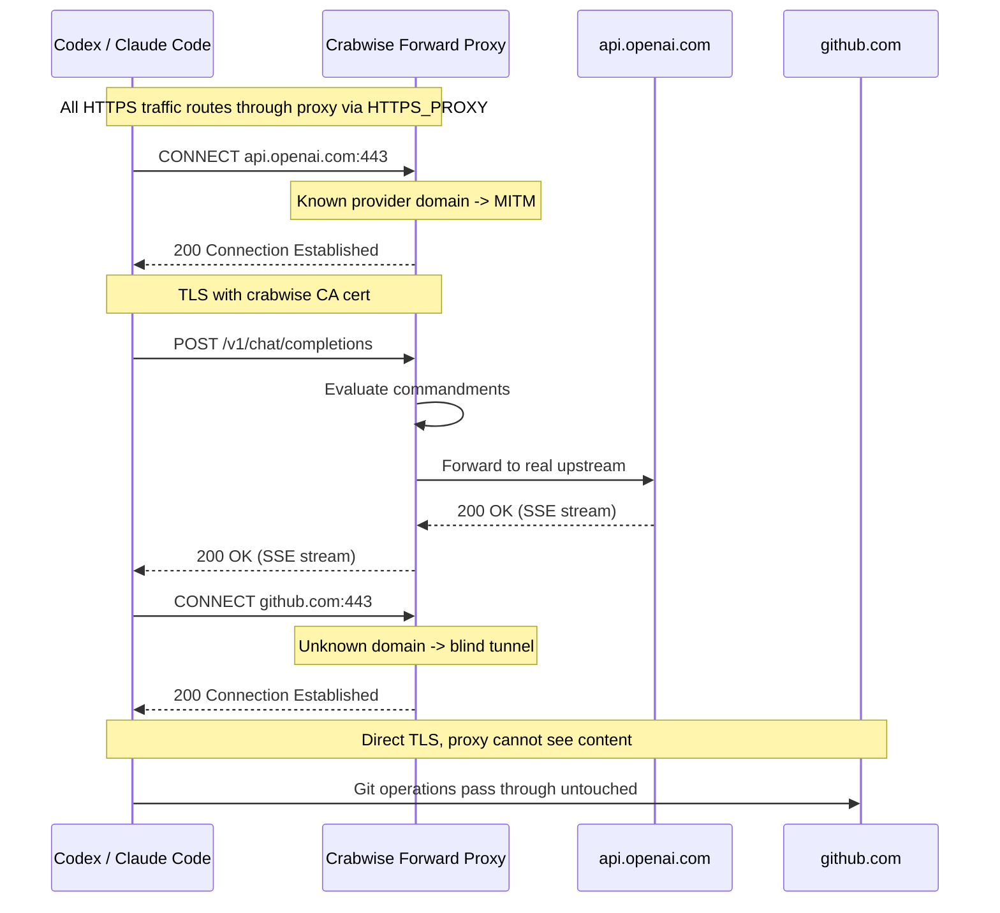

# Reliable Proxy Enforcement for Crabwise

## Problem

The [investigation](docs/proxy-blocking-investigation.md) confirms zero proxy traffic from Codex despite a healthy proxy listener. The proxy is a **reverse proxy** -- clients must change their API base URL to `http://127.0.0.1:9119`. Codex never did this, so all traffic went directly to OpenAI.

The reverse proxy approach is inherently fragile: each client has its own env var, users forget to set them, and nothing prevents bypassing. We are replacing it with a forward proxy.

## Solution: Forward Proxy with Selective MITM

Convert to an HTTP forward proxy. Transparently tunnel all traffic, except for configured AI provider domains which get MITM TLS interception for content inspection and commandment enforcement.

**Why this works:**

- **One env var covers all providers**: `HTTPS_PROXY=http://127.0.0.1:9119`
- **Non-AI traffic is unaffected**: git, npm, curl to docs sites -- all tunnel through transparently
- **No per-client base URL knowledge needed**: client connects to the real domain; proxy sees it in the CONNECT header
- **Existing proxy internals are fully reused**: CONNECT handler is a new outer shell that feeds decrypted requests into the existing `handleProxy` pipeline

## Key Decisions

### Unknown CONNECT targets tunnel transparently

When `HTTPS_PROXY` is set, **all** HTTPS traffic from the process goes through the proxy. If we denied unknown domains, `crabwise wrap -- codex` would break the moment Codex does a `git clone`, `npm install`, or hits any non-AI HTTPS endpoint.

The right model (and the industry standard for selective MITM proxies): tunnel everything by default, intercept only what's configured. The intercept set is auto-derived from `providers[].upstream_base_url` in config -- no manual domain lists to maintain.

- Known AI provider domain -> MITM: decrypt, inspect, apply commandments, forward
- Everything else -> blind TCP tunnel: proxy cannot see content, traffic passes through unmodified

Security is maintained because the proxy binds to loopback only (`127.0.0.1`) and only governs the domains explicitly configured as providers.

### Client-facing TLS is HTTP/1.1 only

The MITM TLS handshake advertises `NextProtos: ["http/1.1"]`. The existing `handleProxy` pipeline is HTTP/1.1. Most clients fall back silently when h2 isn't offered. Upstream connections are independent -- Go's `http.Transport` negotiates h2 with providers automatically where supported.

### CA lifecycle is simple

A local MITM CA is not a production TLS certificate. It lives on one machine, serves one user, and can have a 10-year validity.

- `crabwise init` generates CA if it doesn't exist (idempotent)
- Daemon startup validates CA exists and parses; if not, fail with "run `crabwise init`"
- Key file permissions checked at startup (`0600`); fail if wrong
- Need a new CA: `crabwise init --force` regenerates and prints trust instructions

No rotation commands, no CA audit events, no config toggles. This gets revisited when team/multi-machine deployments exist.

### One domain = one provider

Every AI provider has its own API domain (`api.openai.com`, `api.anthropic.com`, etc.). Domain maps to exactly one provider. If someone configures two providers with the same upstream domain, config validation catches it at startup.

`ResolveByDomain(host) -> (provider, error)`. No multi-step disambiguation, no shared-domain path routing.

### Client compatibility is validated by testing, not process

- Does `HTTPS_PROXY` work with Codex? (The client that broke -- this is the acceptance test.)
- Does it work with `curl`? (Universal sanity check.)
- If proxy sees zero CONNECT requests after 30s of uptime, log a warning.

Expand the compatibility matrix as users report issues, not upfront.

## Build Strategy: Evolve, Don't Rewrite

**Stays as-is (reused directly):**

- `[proxy.go](internal/adapter/proxy/proxy.go)` `handleProxy` -- the entire request processing pipeline
- `[streaming.go](internal/adapter/proxy/streaming.go)` -- SSE passthrough
- `[mapping.go](internal/adapter/proxy/mapping.go)` -- provider request/response normalization
- `[openai.go](internal/adapter/proxy/openai.go)` -- OpenAI transport
- `[provider.go](internal/adapter/proxy/provider.go)` -- Transport interface, ProviderRuntime
- `[cost.go](internal/adapter/proxy/cost.go)` -- cost computation
- `[redaction.go](internal/adapter/proxy/redaction.go)` -- payload redaction

**New files:**

- `internal/adapter/proxy/ca.go` -- CA cert generation, ephemeral cert signing, bounded cert cache
- `internal/adapter/proxy/connect.go` -- CONNECT handler: tunnel or MITM based on domain, hijack, TLS, feed into handleProxy
- `internal/cli/wrap.go` -- `crabwise wrap` command
- `internal/cli/env.go` -- `crabwise env` command

**Modified files:**

- `internal/adapter/proxy/proxy.go` -- `Start()` routes CONNECT to new handler
- `internal/adapter/proxy/router.go` -- add `ResolveByDomain(host)`
- `internal/daemon/config.go` -- CA paths, remove reverse-proxy-only fields, one-domain-one-provider validation
- `configs/default.yaml` -- updated defaults
- `internal/cli/root.go` -- register wrap and env commands
- `internal/cli/init.go` -- CA generation during init

## Implementation Order

1. **CA generation** (`ca.go`) -- standalone, testable in isolation
2. **Config update** -- CA paths, derive intercept domains, one-domain-one-provider validation
3. **Domain router** -- `ResolveByDomain` on existing Router
4. **CONNECT handler** (`connect.go`) -- tunnel unknown, MITM known, feed into handleProxy
5. **Proxy.Start() refactor** -- route CONNECT to new handler
6. `**crabwise init` update** -- generate CA, print trust instructions
7. `**wrap` and `env` commands** -- CLI convenience
8. **Cleanup** -- remove reverse-proxy-only code
9. **Tests** -- focused on the invariants that matter

## Test Invariants

The tests that matter for this architecture:

1. **Blocked requests never reach upstream** -- the core invariant and the reason this project exists
2. **Unknown domains tunnel through** -- `crabwise wrap` doesn't break non-AI traffic
3. **Known domains get intercepted** -- MITM handshake succeeds, request is readable, commandments evaluate
4. **SSE streaming works through MITM** -- no perceptible latency, no data corruption
5. **CA generation is idempotent** -- init twice doesn't break anything
6. `**-race` passes** -- no data races in concurrent tunnel/MITM handling
7. **Goroutine/connection cleanup** -- tunnels and MITM connections don't leak

## What This Does NOT Solve

- **Tool execution blocking**: `rm -rf` is a local tool execution, not an API call. The proxy intercepts provider traffic only. Log watcher remains the observation surface for tool execution.
- **Certificate pinning**: extremely rare in AI SDKs.
- **Client-edge HTTP/2**: deferred; h1 is sufficient for AI API traffic patterns.

