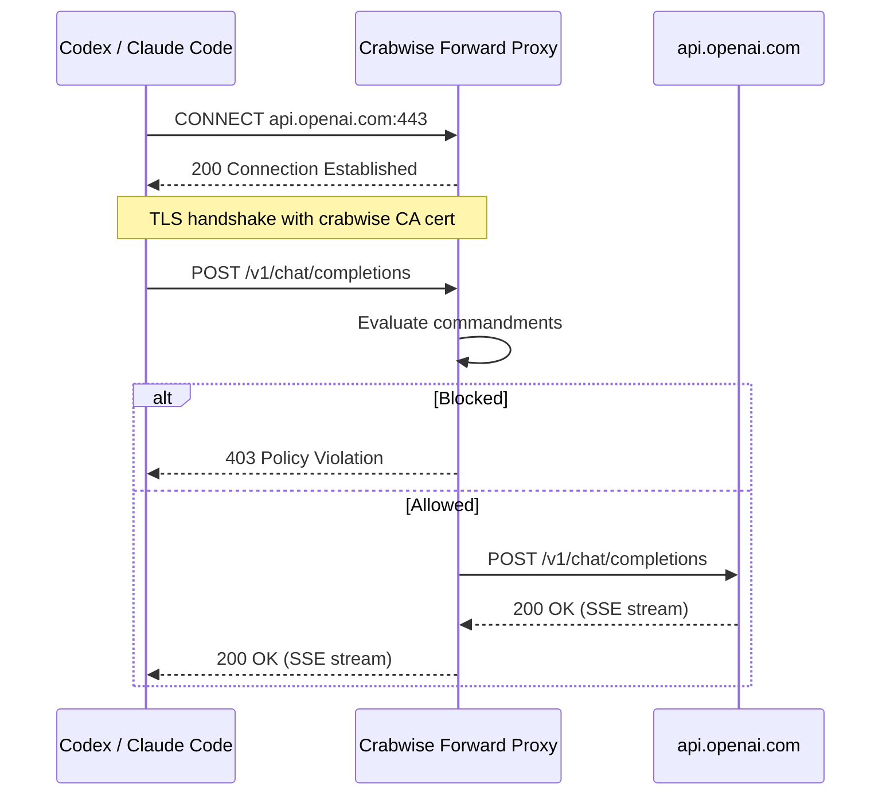

# Reliable Proxy Enforcement for Crabwise

## Problem

The [investigation](docs/proxy-blocking-investigation.md) confirms zero proxy traffic from Codex despite a healthy proxy listener. The proxy is a **reverse proxy** -- clients must change their API base URL to `http://127.0.0.1:9119`. Codex never did this, so all traffic went directly to OpenAI.

The reverse proxy approach is inherently fragile: each client has its own env var, users forget to set them, and nothing prevents bypassing. We are dropping it entirely in favor of a forward proxy.

## Solution: Forward Proxy with MITM TLS

Convert to a standard HTTP forward proxy (HTTP CONNECT + selective MITM TLS). This is how mitmproxy, Charles Proxy, and corporate HTTPS proxies work.

**Why this works:**

- **One env var covers all providers**: `HTTPS_PROXY=http://127.0.0.1:9119`
- **Most HTTP libs auto-detect it**: Go `net/http`, Node.js, Python `requests`, `curl`
- **No per-client base URL knowledge needed**: client connects to the real domain; proxy sees it in the CONNECT header
- **Existing proxy internals are fully reused**: the CONNECT handler is a new outer shell that feeds decrypted requests into the existing `handleProxy` pipeline

## Build Strategy: Evolve, Don't Rewrite

The current proxy code has well-tested internals that the forward proxy reuses directly:

- `[proxy.go](internal/adapter/proxy/proxy.go)` `handleProxy` -- request normalization, commandment evaluation, audit event building, upstream forwarding (stays as-is, becomes the inner handler)
- `[streaming.go](internal/adapter/proxy/streaming.go)` -- SSE passthrough (stays as-is)
- `[mapping.go](internal/adapter/proxy/mapping.go)` -- provider mapping/normalization (stays as-is)
- `[router.go](internal/adapter/proxy/router.go)` -- provider resolution (extended with domain-based routing)
- `[openai.go](internal/adapter/proxy/openai.go)` -- OpenAI transport (stays as-is)
- `[provider.go](internal/adapter/proxy/provider.go)` -- Transport interface, ProviderRuntime (stays as-is)

**New code:**

- `internal/adapter/proxy/ca.go` -- CA cert generation + ephemeral cert signing
- `internal/adapter/proxy/connect.go` -- CONNECT handler: hijack, MITM TLS, feed into `handleProxy`

**Modified code:**

- `internal/adapter/proxy/proxy.go` -- `Start()` detects CONNECT vs regular HTTP
- `internal/adapter/proxy/router.go` -- add `ResolveByDomain(host)` alongside existing `Resolve(req)`
- `internal/daemon/config.go` -- CA cert/key paths, remove reverse-proxy-only fields
- `configs/default.yaml` -- updated defaults
- `internal/cli/root.go` -- register `wrap` and `env` commands
- `internal/cli/init.go` -- generate CA cert during init

**New CLI commands:**

- `internal/cli/wrap.go` -- `crabwise wrap -- codex` sets `HTTPS_PROXY` + `NODE_EXTRA_CA_CERTS` then execs
- `internal/cli/env.go` -- `crabwise env` outputs sourceable env vars

## Implementation Order

1. **CA generation** (`ca.go`) -- no dependencies, can test in isolation
2. **Config update** -- add CA paths, derive intercept domains from provider URLs
3. **Domain router** -- `ResolveByDomain` on existing Router
4. **CONNECT handler** (`connect.go`) -- the core new code; hijack, MITM, feed into `handleProxy`
5. **Proxy.Start() refactor** -- route CONNECT to new handler
6. `**crabwise init` update** -- generate CA cert on init
7. `**wrap` and `env` commands** -- CLI convenience
8. **Cleanup** -- remove reverse-proxy-only code paths and config
9. **Tests** -- integration coverage for the new flow

## What This Does NOT Solve

- **Tool execution blocking**: `rm -rf` is a local tool execution, not an API call. The proxy intercepts provider traffic only. Log watcher remains the observation surface for tool execution.
- **Certificate pinning**: extremely rare in AI SDKs, and clients that pin certs typically also ignore base URL overrides, so the reverse proxy wouldn't help either.

